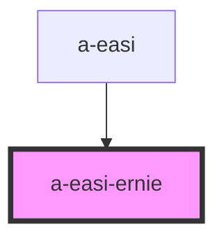

# a-easi-ernie

<!-- Auto Generated Below -->

## Properties

| Property         | Attribute         | Description | Type                                                                              | Default     |
| ---------------- | ----------------- | ----------- | --------------------------------------------------------------------------------- | ----------- |
| `selectedRegion` | `selected-region` |             | `EasiRegions.Head \| EasiRegions.Lower \| EasiRegions.Trunk \| EasiRegions.Upper` | `null`      |
| `value`          | --                |             | `IEasi`                                                                           | `undefined` |

## Events

| Event          | Description | Type                                                                                           |
| -------------- | ----------- | ---------------------------------------------------------------------------------------------- |
| `selectRegion` |             | `CustomEvent<EasiRegions.Head \| EasiRegions.Lower \| EasiRegions.Trunk \| EasiRegions.Upper>` |

## Dependencies

### Used by

 - [a-easi](..\a-easi)

### Graph

----------------------------------------------

*Built with [StencilJS](https://stenciljs.com/)*
