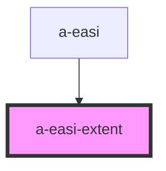

# a-easi-extent

<!-- Auto Generated Below -->

## Properties

| Property   | Attribute   | Description | Type                                                                                                                                                | Default          |
| ---------- | ----------- | ----------- | --------------------------------------------------------------------------------------------------------------------------------------------------- | ---------------- |
| `disabled` | `disabled`  |             | `boolean`                                                                                                                                           | `undefined`      |
| `showText` | `show-text` |             | `boolean`                                                                                                                                           | `undefined`      |
| `value`    | `value`     |             | `EasiExtents.E0 \| EasiExtents.E10_29 \| EasiExtents.E1_9 \| EasiExtents.E30_49 \| EasiExtents.E50_69 \| EasiExtents.E70_89 \| EasiExtents.E90_100` | `EasiExtents.E0` |

## Events

| Event    | Description | Type                                                                                                                                                             |
| -------- | ----------- | ---------------------------------------------------------------------------------------------------------------------------------------------------------------- |
| `change` |             | `CustomEvent<EasiExtents.E0 \| EasiExtents.E10_29 \| EasiExtents.E1_9 \| EasiExtents.E30_49 \| EasiExtents.E50_69 \| EasiExtents.E70_89 \| EasiExtents.E90_100>` |

## Dependencies

### Used by

 - [a-easi](..\a-easi)

### Graph

----------------------------------------------

*Built with [StencilJS](https://stenciljs.com/)*
