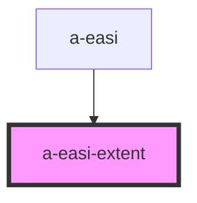

# a-easi-extent

<!-- Auto Generated Below -->

## Properties

| Property   | Attribute   | Description | Type                                                                                                                                         | Default         |
| ---------- | ----------- | ----------- | -------------------------------------------------------------------------------------------------------------------------------------------- | --------------- |
| `disabled` | `disabled`  |             | `boolean`                                                                                                                                    | `undefined`     |
| `showText` | `show-text` |             | `boolean`                                                                                                                                    | `undefined`     |
| `value`    | `value`     |             | `EasiExtent.E0 \| EasiExtent.E10_29 \| EasiExtent.E1_9 \| EasiExtent.E30_49 \| EasiExtent.E50_69 \| EasiExtent.E70_89 \| EasiExtent.E90_100` | `EasiExtent.E0` |

## Events

| Event    | Description | Type                                                                                                                                                      |
| -------- | ----------- | --------------------------------------------------------------------------------------------------------------------------------------------------------- |
| `change` |             | `CustomEvent<EasiExtent.E0 \| EasiExtent.E10_29 \| EasiExtent.E1_9 \| EasiExtent.E30_49 \| EasiExtent.E50_69 \| EasiExtent.E70_89 \| EasiExtent.E90_100>` |

## Dependencies

### Used by

 - [a-easi](..\a-easi)

### Graph

----------------------------------------------

*Built with [StencilJS](https://stenciljs.com/)*
