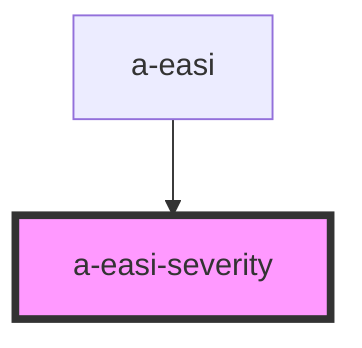

# a-easi-severity

<!-- Auto Generated Below -->

## Properties

| Property   | Attribute   | Description | Type                                                                                                                                                     | Default             |
| ---------- | ----------- | ----------- | -------------------------------------------------------------------------------------------------------------------------------------------------------- | ------------------- |
| `disabled` | `disabled`  |             | `boolean`                                                                                                                                                | `undefined`         |
| `showText` | `show-text` |             | `boolean`                                                                                                                                                | `undefined`         |
| `value`    | `value`     |             | `EasiSeverity.Mild \| EasiSeverity.MildToModerate \| EasiSeverity.Moderate \| EasiSeverity.ModerateToSevere \| EasiSeverity.None \| EasiSeverity.Severe` | `EasiSeverity.None` |

## Events

| Event    | Description | Type                                                                                                                                                                  |
| -------- | ----------- | --------------------------------------------------------------------------------------------------------------------------------------------------------------------- |
| `change` |             | `CustomEvent<EasiSeverity.Mild \| EasiSeverity.MildToModerate \| EasiSeverity.Moderate \| EasiSeverity.ModerateToSevere \| EasiSeverity.None \| EasiSeverity.Severe>` |

## Dependencies

### Used by

 - [a-easi](..\a-easi)

### Graph

----------------------------------------------

*Built with [StencilJS](https://stenciljs.com/)*
