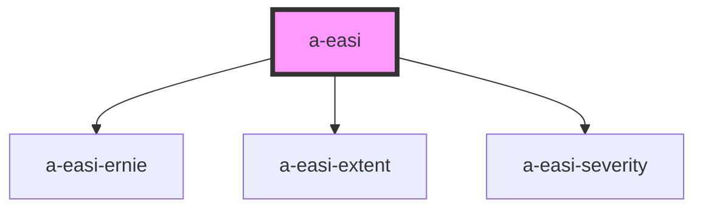

# a-easi

<!-- Auto Generated Below -->

## Properties

| Property         | Attribute         | Description | Type                                                                          | Default           |
| ---------------- | ----------------- | ----------- | ----------------------------------------------------------------------------- | ----------------- |
| `isChild`        | `is-child`        |             | `boolean`                                                                     | `undefined`       |
| `selectedRegion` | `selected-region` |             | `EasiRegion.Head \| EasiRegion.Lower \| EasiRegion.Trunk \| EasiRegion.Upper` | `EasiRegion.Head` |
| `showText`       | `show-text`       |             | `boolean`                                                                     | `undefined`       |
| `value`          | --                |             | `IEasiValue`                                                                  | `undefined`       |

## Events

| Event    | Description | Type                      |
| -------- | ----------- | ------------------------- |
| `change` |             | `CustomEvent<IEasiValue>` |

## Dependencies

### Depends on

- [a-easi-ernie](..\a-easi-ernie)
- [a-easi-extent](..\a-easi-extent)
- [a-easi-severity](..\a-easi-severity)

### Graph

----------------------------------------------

*Built with [StencilJS](https://stenciljs.com/)*
