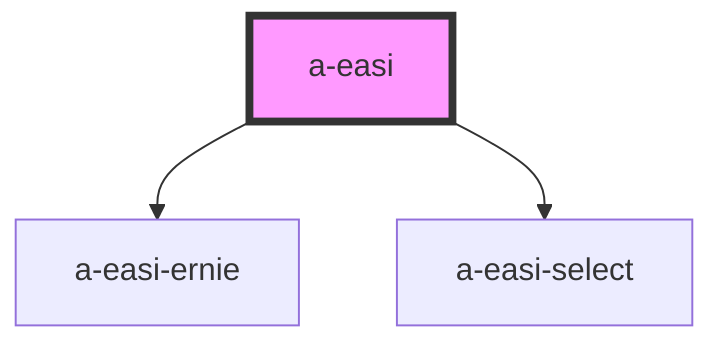

# a-easi

<!-- Auto Generated Below -->

## Properties

| Property   | Attribute   | Description | Type         | Default     |
| ---------- | ----------- | ----------- | ------------ | ----------- |
| `score`    | --          |             | `IEasiScore` | `undefined` |
| `showText` | `show-text` |             | `boolean`    | `undefined` |
| `value`    | --          |             | `IEasi`      | `undefined` |

## Events

| Event         | Description | Type                      |
| ------------- | ----------- | ------------------------- |
| `change`      |             | `CustomEvent<IEasi>`      |
| `scoreChange` |             | `CustomEvent<IEasiScore>` |

## Dependencies

### Depends on

- [a-easi-ernie](..\a-easi-ernie)
- [a-easi-select](..\a-easi-select)

### Graph

----------------------------------------------

*Built with [StencilJS](https://stenciljs.com/)*
