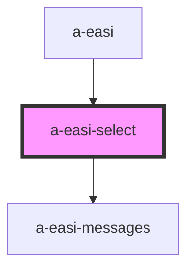

# a-easi-select

<!-- Auto Generated Below -->

## Properties

| Property      | Attribute    | Description | Type                         | Default     |
| ------------- | ------------ | ----------- | ---------------------------- | ----------- |
| `disabled`    | `disabled`   |             | `boolean`                    | `false`     |
| `errors`      | --           |             | `IEasiMessages \| undefined` | `undefined` |
| `nullValue`   | `null-value` |             | `any`                        | `null`      |
| `options`     | --           |             | `any[]`                      | `[]`        |
| `optionsText` | --           |             | `{ [key: string]: string; }` | `{}`        |
| `required`    | `required`   |             | `boolean`                    | `false`     |
| `showText`    | `show-text`  |             | `boolean`                    | `false`     |
| `value`       | `value`      |             | `any`                        | `undefined` |

## Events

| Event         | Description | Type               |
| ------------- | ----------- | ------------------ |
| `valueChange` |             | `CustomEvent<any>` |

## Methods

### `validate() => Promise<IEasiMessages>`

#### Returns

Type: `Promise<IEasiMessages>`

## Dependencies

### Used by

 - [a-easi](../a-easi)

### Depends on

- [a-easi-messages](../a-messages)

### Graph

----------------------------------------------

*Built with [StencilJS](https://stenciljs.com/)*
