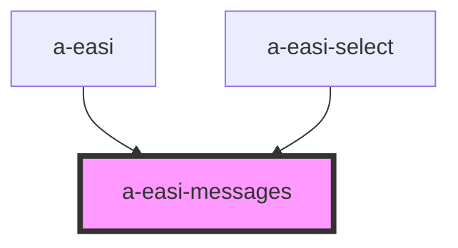

# a-easi-messages

<!-- Auto Generated Below -->

## Properties

| Property | Attribute | Description | Type                             | Default             |
| -------- | --------- | ----------- | -------------------------------- | ------------------- |
| `type`   | `type`    |             | `"error" \| "info" \| "warning"` | `undefined`         |
| `value`  | --        |             | `IEasiMessages`                  | `easiEmptyMessages` |

## Dependencies

### Used by

 - [a-easi](../a-easi)
 - [a-easi-select](../a-easi-select)

### Graph

----------------------------------------------

*Built with [StencilJS](https://stenciljs.com/)*
